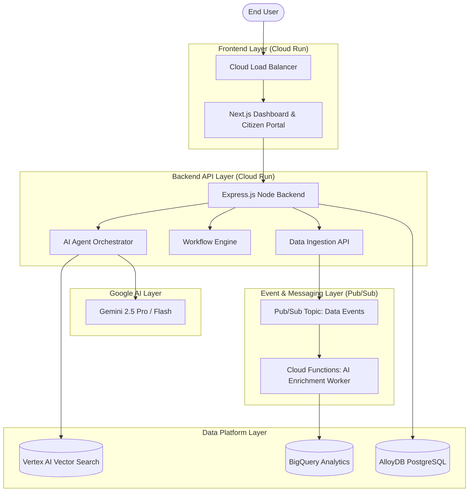

# CommunityAI: Google Cloud Enterprise Architecture

This document details the production architecture for deploying CommunityAI to Google Cloud Platform (GCP). The system is designed to be **Cloud-Native**, **AI-First**, and **Event-Driven**, scaling seamlessly to support millions of citizen events.

## 1. High-Level Architecture Topology

CommunityAI utilizes a Serverless Microservices architecture to maximize horizontal scalability while optimizing costs.

## 2. Core GCP Services Utilized

### Cloud Run (Compute)
Both the Next.js Frontend and the Express.js Backend are containerized via Docker and deployed to Cloud Run. This provides serverless execution, auto-scaling from zero to thousands of instances during traffic spikes, and eliminates infrastructure management overhead.

### Vertex AI & Gemini (Intelligence)
- **Gemini 2.5:** Acts as the core reasoning engine for our Multi-Agent framework. It powers the Citizen Support, Mobility, and Healthcare agents.
- **Vertex AI Vector Search:** We use Google's highly scalable ANN (Approximate Nearest Neighbor) vector database to store our Document Chunks. This powers the RAG (Retrieval-Augmented Generation) layer, allowing agents to instantly recall Community Policies.

### Pub/Sub & Cloud Functions (Event-Driven Pipeline)
When a citizen submits a complaint or an IoT sensor fires, the `DataEvent` is published to a Pub/Sub topic. This triggers a Cloud Function (our Enrichment Worker) that asynchronously categorizes the data via Gemini and triggers the Workflow Engine, ensuring the main API never blocks.

### AlloyDB & BigQuery (Data Storage)
- **AlloyDB for PostgreSQL:** Provides a highly available, enterprise-grade transactional database for user accounts, active workflows, and system metadata.
- **BigQuery:** Used as the Community Intelligence Data Warehouse. Historical risk forecasts, sensor data, and long-term anomaly logs are streamed to BigQuery for deep analytics and Looker dashboard integrations.

## 3. DevOps & CI/CD Strategy

### Infrastructure as Code (Terraform)
All GCP resources (Databases, Cloud Run instances, Pub/Sub topics, IAM roles) are defined declaratively in `infra/main.tf`. This ensures identical environments across Development, Staging, and Production.

### GitHub Actions
The `.github/workflows/deploy.yml` pipeline automates deployment. On every push to the `main` branch:
1. The code is tested and linted.
2. Docker images are built and pushed to **Google Artifact Registry**.
3. Revisions are deployed to **Cloud Run** with zero downtime.

## 4. Security & Zero-Trust Framework

- **IAM Least Privilege:** Services only have access to what they need. Cloud Run runs under a dedicated Service Account that only has access to the AlloyDB instance and Gemini API.
- **Secret Manager:** All sensitive credentials (API Keys, Database passwords, JWT Secrets) are stored securely in Google Secret Manager and injected into Cloud Run at runtime.
- **Network Security:** The AlloyDB instance is deployed in a VPC with private IP only. Cloud Run connects to it via a Serverless VPC Access Connector.

## 5. Scalability Metrics

This architecture is designed to support:
- **API Response Time:** < 500ms
- **AI Response Time:** < 5 Seconds
- **Scalability:** Horizontal auto-scaling capable of handling 100K+ concurrent requests.
- **High Availability:** Multi-zone deployments ensuring 99.9% uptime.
